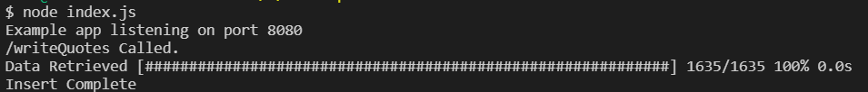
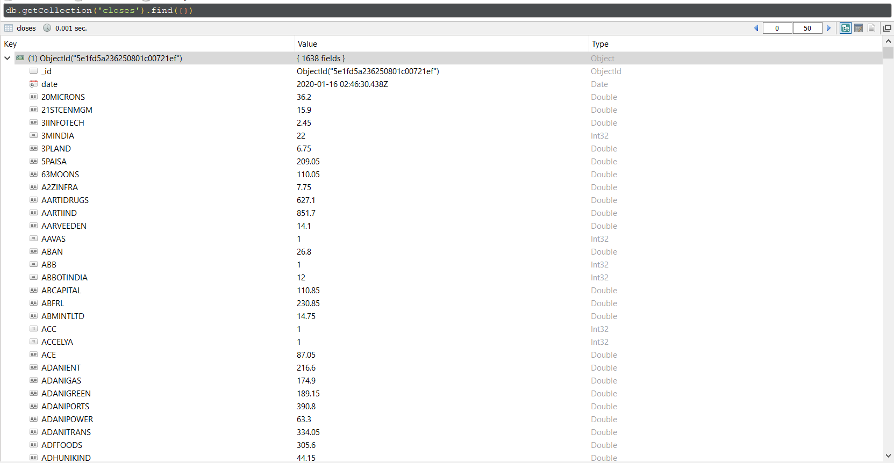
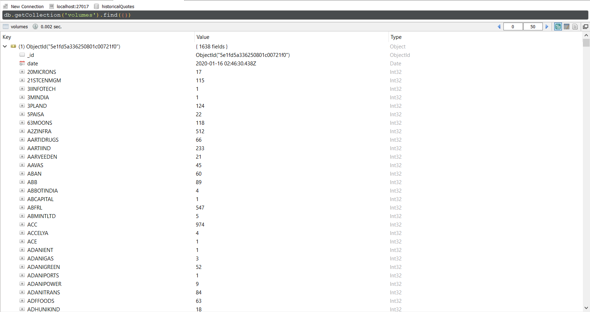

# Fetch Stock Quotes

## Prerequisite

>node 

## Install Dependencies

```bash
npm install
```

## Start Application

```bash
node index
```

## [Config Files](./config.json)

>Following values can be configured before starting the app
  
>>port: port on which the app will run.

>>connectionURL: MongoDB server ULR

>>databaseName: Database name for collections to be stored in.

>>maxTry: Maximum number of times to retry fetch quotes if it fails first time.

>>timeout: Timeout for each fetch call.

```json
{
    "port": 8080,
    "connectionURL": "mongodb://127.0.0.1:27017",
    "databaseName": "historicalQuotes",
    "maxTry": 10,
    "timeout": 1200000
}
```


## Description:

This Node Application creates a Express server hosting two APIs. It scrapes data from [in.finance.yahoo.com/quote/](https://in.finance.yahoo.com/quote/).

### /getQuote

This API gets Current Day quotes of passed stock symbol and exchange(NSE/BSE).

```url
GET /getQuote?exchange=<exchange>&symbol=<stock-symbol>
```

  Example Request

  ```bash
  curl --location --request GET 'http://localhost:8080/getQuote?exchange=NSE&symbol=NTPC'
  ```

  Example Response

  ```json
  {
    "close": 122.6,
    "prevClose": 123.85,
    "open": 123.4,
    "volume": 334,
    "avgVolume3Months": 7913068,
    "marketCap": 1.214,
    "monthly5Years": 0.31,
    "peRatio": 8.87,
    "epsRatio": 13.82
    }
  ```
  
Server Side Console


### /writeQuotes

This API loops over [equitiesList.json](./db/equityList/equitiesList.json) for Stock Symbols and save close quote and volume quote for each stock for current date and give exchange(NSE/BSE) in a MongoDB database. It creates a collection each for "close" and "volume". It can be used by admin users to create historical data set.

```url
POST writeQuotes?exchange=<exchange>
```

  Example Request

  ```bash
  curl --location --request POST 'http://localhost:8080/writeQuotes?exchange=NSE'
  ```

  Example Response

  ```text
  Insert Complete
  ```

Server Side Console



MongoDB Collections

closes(Robo3T Screenshot)



volumes(Robo3T Screenshot)


